=======
# PHP E-Commerce System

A full-stack eCommerce web application developed using **PHP** and **MySQL**.  
The system allows users to browse products, add items to cart, place orders, and manage accounts.  
An admin panel is included for managing products, categories, and orders.

---

## 🚀 Features

### User Side
- User registration & login
- Product listing by category
- Add to cart & update quantity
- Checkout & order placement
- Order history

### Admin Panel
- Admin authentication
- Add / update / delete products
- Manage categories
- View customer orders
- Order status management

---

## 🛠️ Technologies Used
- PHP (Core PHP)
- MySQL
- HTML5
- CSS3
- JavaScript
- Bootstrap

---

# PHP E-Commerce System

A full-stack eCommerce web application developed using **PHP** and **MySQL**.  
The system allows users to browse products, add items to cart, place orders, and manage accounts.  
An admin panel is included for managing products, categories, and orders.

---

## 🚀 Features

### User Side
- User registration & login
- Product listing by category
- Add to cart & update quantity
- Checkout & order placement
- Order history

### Admin Panel
- Admin authentication
- Add / update / delete products
- Manage categories
- View customer orders
- Order status management

---

## 🛠️ Technologies Used
- PHP (Core PHP)
- MySQL
- HTML5
- CSS3
- JavaScript
- Bootstrap

---
## 📸 Screenshots

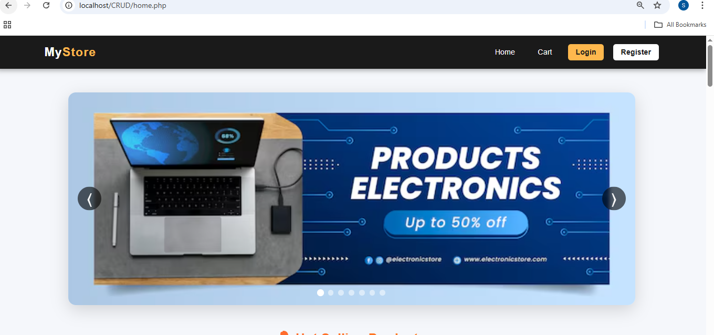
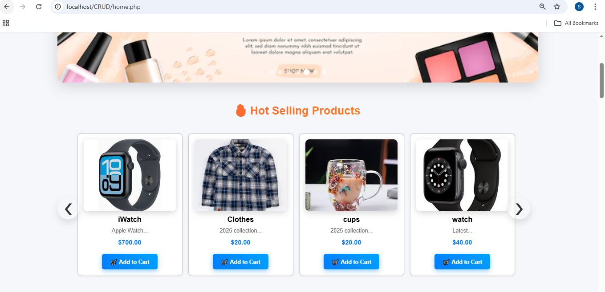
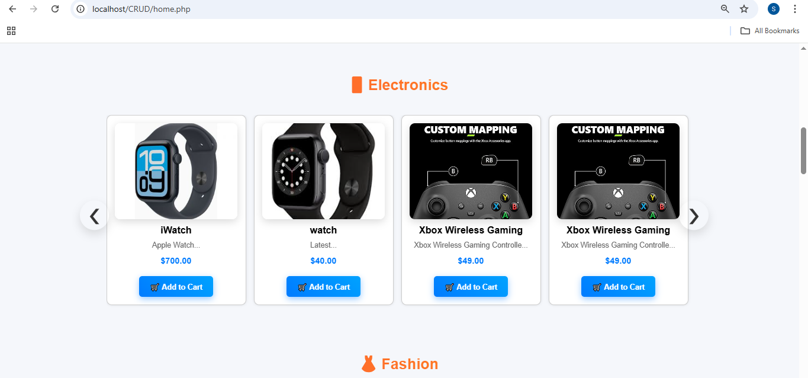
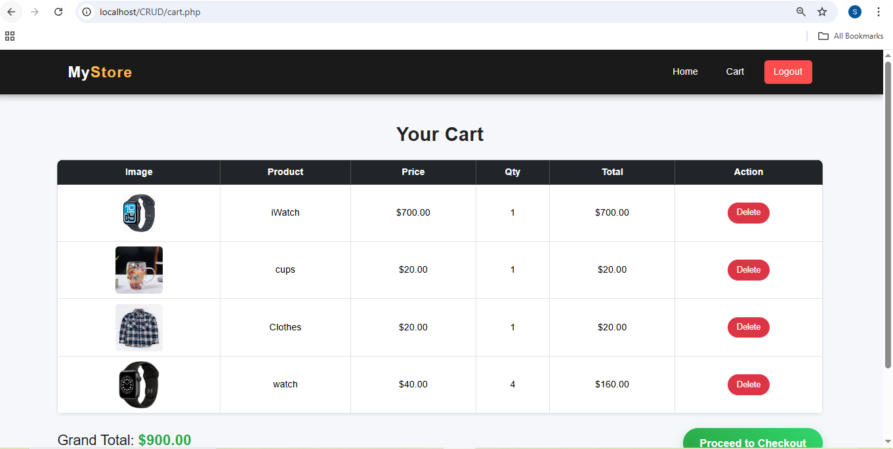
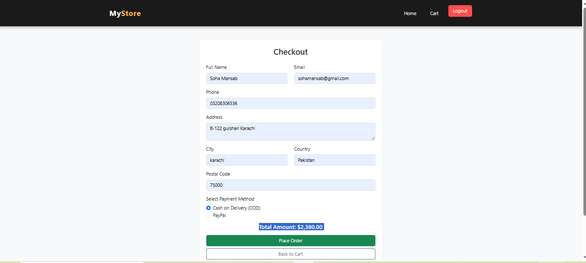
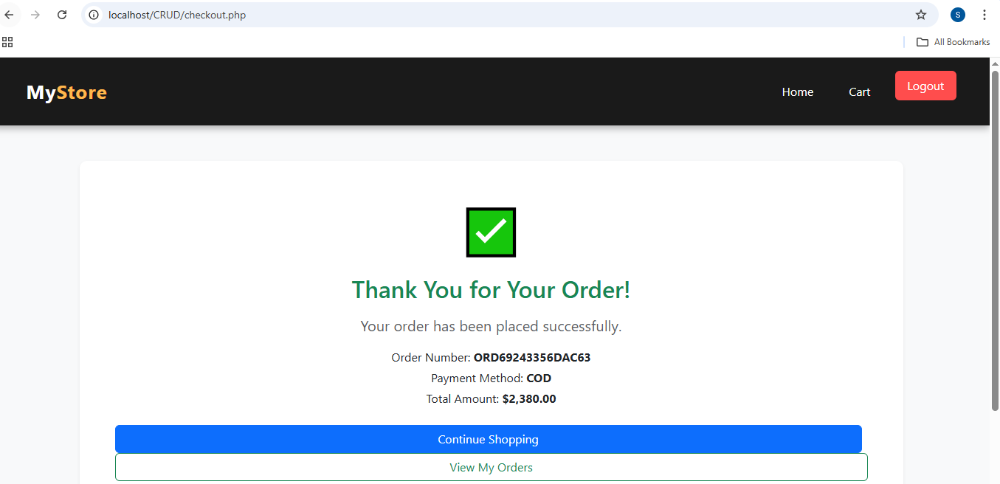
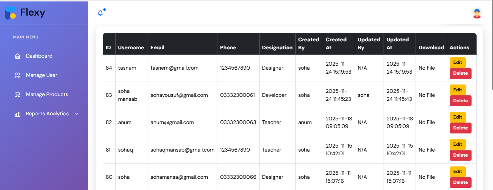
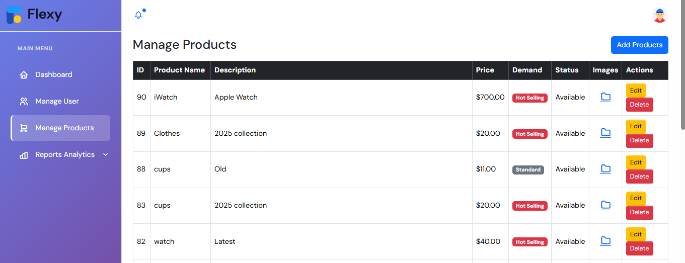
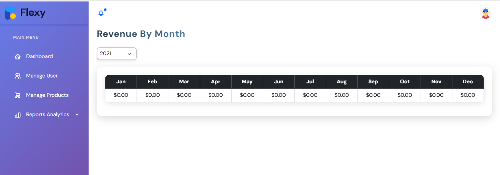
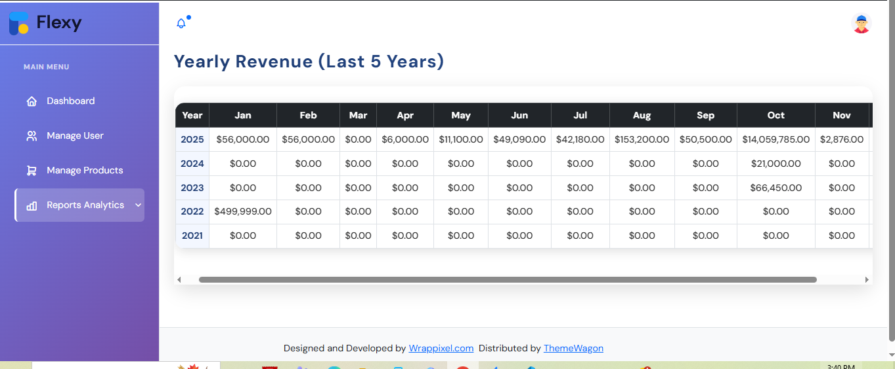
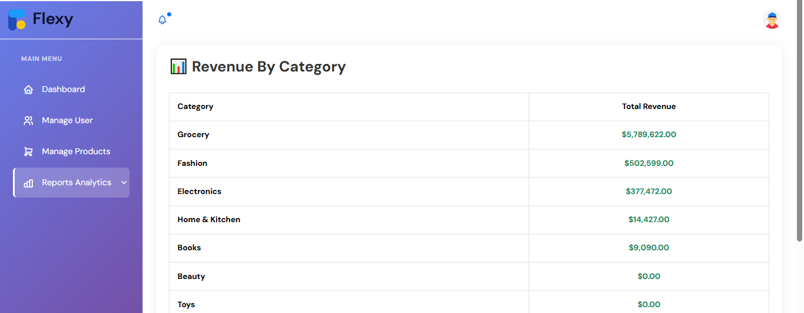
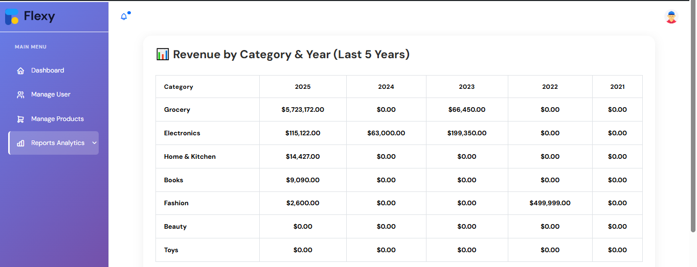

